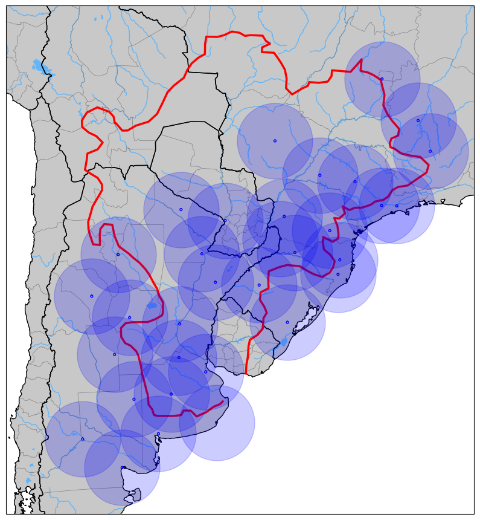

<!DOCTYPE html>
<html lang="es">

<body>
<header>
<h1>Integración de Radares Meteorológicos en la Cuenca del Plata</h1>
</header>

</main>
        
<section>
<h2>Motivación</h2>

Actualmente los radares meteorológicos desempeñan un papel crucial en las operaciones de los Servicios Meteorológicos e Hidrológicos Nacionales. Gracias a la gran cobertura, la alta resolución espacial y el rápido ciclo de actualización de las observaciones son particularmente adecuados para monitorear y pronosticar diversos fenómenos hidrometeorológicos de alto impacto que causan daños significativos cada año en los países que conforman la Cuenca del Plata. Estos fenómenos se encuentran entre las amenazas de más alta prioridad a nivel mundial, según lo informado por la Organización Meteorológica Mundial (OMM) para la actual iniciativa de <a href="https://earlywarningsforall.org/site/early-warnings-all" target="_blank">Alertas Tempranas para Todos (EW4All)</a> de las Naciones Unidas.
                
Sin embargo, ejecutar un programa de radares meteorológicos eficiente y exitoso requiere recursos suficientes y capacidades adecuadas en la adquisición de radares, gestión de redes, monitoreo y procesamiento de datos, y formación de recursos humanos. Además, para ofrecer alertas tempranas y pronósticos hidrometeorológicos de alto impacto eficientes en la región, es necesario intercambiar datos de radar entre los países en tiempo real para brindar productos de radar integrados, como mosaicos regionales que fortalezcan los sistemas transfronterizos de monitoreo hidrometeorológico.

Lograr estos objetivos requiere esfuerzos conjuntos entre los países de la <a href="https://cicplata.org/es/" target="_blank">Cuenca</a>, tales como el establecimiento de un intercambio de datos utilizando formatos de datos y métodos de procesamiento estandarizados, así como la aplicación de prácticas armonizadas para gestionar las redes operativas de radares meteorológicos en cada uno de los países involucrados. Un paso importante hacia estos objetivos es apoyar a los mismos a través de actividades específicas de desarrollo de capacidades en materia de radares meteorológicos y facilitar los debates entre los países para compartir conocimientos e información, promoviendo el intercambio operativo de datos de radares meteorológicos.

La integración a nivel Cuenca del Plata de los radares meteorológicos permitirá mejorar de manera sustantiva el monitoreo de los fenomenos meteorologicos y de los recursos hídricos aportando herramientas y productos de avanzada y de suma relevancia que permitirán fortalecer los sistemas de apoyo a la toma de decisiones ante eventos hidrometeorológicos de alto impacto para la región.

</section>

<section>
<h2>Estado actual de la red</h2>

En la actualidad, la Cuenca del Plata cuenta con un total de aproximadamente 30 radares meteorológicos operativos pertenecientes a diferentes organismos e instituciones de diferentes niveles de gobierno y áreas dentro de los siguientes tres países:

<ul>
<li>Argentina: Subsecretaría de Recursos Hídricos e Instituto Nacional de Tecnología Agropecuaria (INTA).</li>
<li>Brasil: SIMEPAR, DECEA, Defensa Civil de Santa Catarina e IPMet.</li>
<li>Paraguay: Dirección de Meteorología e Hidrología.</li>
</ul>

Tanto Bolivia como Uruguay hoy no cuentan con radares. No obstante, en el caso de Uruguay se ha estado avanzando en un proceso licitatorio para la incorporación de dos radares meteorológicos a ser adquiridos e instalados durante 2025. Del mismo modo, en Argentina y en el marco de la finalización de la Etapa 3 del SINARAME (Sistema Nacional de Radares Meteorológicos), se sumarán cinco radares más dando una mayor cobertura a la cuenca.

El siguiente mapa muestra la ubicación de los radares meteorológicos operativos que hoy cubren la Cuenca del Plata.

</section>

<section>
<h2>Hacia una integración regional</h2>

En términos de integración regional, hoy la misma no existe. No obstante, a mediados de 2024 se propone que la AR-III, en colaboración con la Comisión de Observación, Infraestructura y Sistemas de Información (INFCOM) y la Secretaría de la OMM, establezca un programa regional de desarrollo de capacidades para que los países de la AR-III aborden las cuestiones antes mencionadas. Sin embargo, antes de comenzar actividades más elaboradas y específicas, se propuso organizar un taller inicial entre los países de la AR-III para tener una imagen lo más completa posible de las operaciones de radares meteorológicos y de las deficiencias identificadas en la región. Como parte de este taller inicial se propuso como uno de los objetivos primarios iniciar un diálogo sobre el establecimiento de un intercambio de datos operativos entre los países, así como sobre el desarrollo de productos regionales como un compuesto de reflectividad radar.

Como resultado de este taller, se conforma una Mesa de Trabajo Ad-Hoc entre Argentina y Brasil para delinear los primeros pasos hacia un intercambio regional de datos de radar, el desarrollo de capacidades y la generación de productos de interés para los países involucrados. Por Argentina participan representantes de la Subsecretaría de Recursos Hídricos, del Observatorio Hidrometeorológico de Córdoba (OHMC), del Servicio Meteorológico Nacional (SMN), del Centro de Investigaciones del Mar y la Atmósfera (UBA/CONICET) y de INVAP. Mientras que por Brasil participaron representantes de SIMEPAR y del CPTEC/INPE.

Como primer acuerdo de la mesa, se propuso organizarse en tres grupos: 1) Coordinación interinstitucional, 2) Cuestiones técnicas y 3) Formación y capacitación. De acuerdo a esta estructura, se pudieron dar los primeros pasos. El día 24 de octubre de 2024 se llevó a cabo una primera reunión sobre integración de datos entre el Ing. Dr. Andrés Rodriguez en su rol de Subsecretario de Recursos Hídricos de la Nación Argentina y el entonces Director del SIMEPAR de Brasil, César Beneti. Además de la misma y en carácter de Asesores Técnicos de la SsRH participaron el Ing. Federico Renolfi y el Dr. Luciano Vidal. Por otro lado, se realizaron reuniones técnicas del Grupo 2 para comenzar a trabajar sobre un caso de estudio de un evento de precipitación que afectó el noreste de Argentina y el sur de Brasil, de modo tal de iniciar un procesos de intercambio de datos, fortalecer vinculas y evaluar la necesidad del desarrollo de herramientas tanto de
procesamiento como de visualización.

</section>

<section>
<h2>Cómo empezar</h2>

Proporciona instrucciones claras sobre cómo clonar el repositorio, instalar dependencias y ejecutar el proyecto.

<pre>
git clone https://github.com/LuchoVidalSMN/<nombre-repo>.git
cd <nombre-repo>
npm install
npm start
</pre>
</section>

<section>
    <h2>Características del Proyecto</h2>
    
Este proyecto incluye las siguientes características principales:

    <ul>
        <li>Integración de múltiples radares meteorológicos.</li>
        <li>Visualización de datos en tiempo real.</li>
        <li>Predicciones meteorológicas avanzadas.</li>
        <li>Interfaz fácil de usar.</li>
    </ul>
</section>
        
<section>
<h2>Contribuciones</h2>

Invita a otros a contribuir al proyecto y proporciona un enlace al archivo <a href="CONTRIBUTING.md">CONTRIBUTING.md</a> si lo tienes.

</section>
        
<section>
<h2>Galería de Imágenes</h2>

Esta es una imagen representativa del radar meteorológico:

</section>

</main>

<footer>

&copy; 2025 Lucho Vidal. Todos los derechos reservados.

</footer>

</body>

</html>
